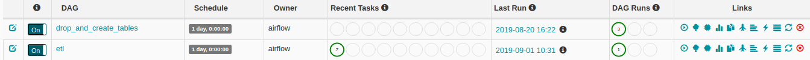
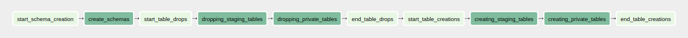
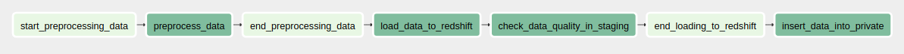

## PROJECT SCOPE
This project focuses on the general practices in England, on the practice level, chemical level and presentation level. 
All registered practices, including GP practices, in England are included in the data, including a number of 'dummy' 
practices.

The practice level shows us what is practice is called, and the addresses of the practice.

The chemical level shows us what chemicals where prescribed or dispensed which include name of chemicals.

The presentation level similar to what the practice level data, shows us what is practice is called, the address of the 
practice, the number of general practicioners with each practice. We also get the number of patients registered with 
each practice whether they are getting a dispensing service or prescribing services.

This project has 4 data sources.
Namely;
* practices.csv - This gives a list of practice names and addresses
Data source can be found [here](https://digital.nhs.uk/data-and-information/publications/statistical/practice-level-prescribing-data/december-2018)

* bnf_codes.csv - It gives information on the indications, dosages and side effects for over 70,000 medicines.
Data source can be found [here](https://apps.nhsbsa.nhs.uk/infosystems/data/showDataSelector.do?reportId=126)
Better explanation of bnf codes can be found [here](https://ebmdatalab.net/prescribing-data-bnf-codes/)

* practice_prescribing.csv (over 1 million rows)
Data source can be found [here](https://digital.nhs.uk/data-and-information/publications/statistical/practice-level-prescribing-data)

* practice_list_size_and_gd_count.csv
Data source can be found [here](https://nhsbsa.nhs.uk/prescription-data/organisation-data/practice-list-size-and-gp-count-each-practice)

This dataset is a month on month dataset with the exception of the bnf_codes.csv and practice_list_size_and_gd_count.csv. 
With regards to the practice_prescribing.csv dataset which already has some 10 million rows.

## DATA MODEL
A snowflake schema is used here because this contains sub-dimension tables including fact and dimension tables.
It uses normalization which splits up the data into additional tables. The splitting results in the reduction of 
redundancy and prevention from memory wastage.
The bnf_codes.csv is normalized 7 into dimension tables which includes;
* bnf_chapters
* bnf_sections
* bnf_paragraphs
* bnf_subparagraphs
* bnf_chemicals
* bnf_products
* bnf_presentations

Better explanation of bnf codes can be found [here](https://ebmdatalab.net/prescribing-data-bnf-codes/)

The practice_list_size_and_gd_count.csv is broken into a facts and dimension tables namely;
* practices
* groups

The practice_prescribing.csv is used as the main facts table (prescriptions) where all the tables connect to
directly or indirectly.

You can an ERD view of the snowflake schema [here](Capstone%20Udacity%20Project.png).
You can also find the data dictionary [here](data_dictionary.md)

## OBJECTIVES OF DATA MODEL
* To see some trends in drugs being prescribed.
For instance based on the months it can be determined which drugs are prescribed
the most by looking at the bnf_chapter the drug belongs to and the condition of 
patients. This will make it easy to determine outbreaks and at what time it
started.

* Can seasons be detected based on the type of drugs being described.
Based on drugs prescribed or dispensed at certain times of the year could show
seasonality. For instance before winter starts a lot of people usually go for
flu shots. This could make it easy to predict that we are about to enter flu
season which also means winter is about to start.

* What patients are receiving certain services whether dispensing or medical services.
The kind of drugs prescribed could also show what kind of patient is being serviced.
Some drugs will usually go to mentally ill patients and some will go the elderly.

## ETL MODEL
On a month to month basis data from all csv files is pushed to the s3 bucket.
These files are read and wrangled using spark to normalized them into parquet files stored
on the s3 bucket.
These processed parquet files are then copied and data from them pushed to respective redshift tables.

This project is orchestrated by Airflow using two dags.

The drop_and_create_tables dag simply runs just ones which drops and creates tables ready for the main
etl process;

The etl dag is made up of four main pipelines;
* preprocess_data_to_s3 - this uses spark to read data files from s3 bucket and normalize some files into
various dimension tables which then stores them as parquet files and pushes them back to the s3 bucket

* load_data_to_redshift_staging - this reads parquets files from s3 bucket using redshift sql syntax and copies
data to their respective tables.

* check_staging_data_quality - Because the data is month on month, I expect to always have data in the redshift
staging tables so this goes to check if data push to the staging schema is one or more rows.

* insert_data_into_private - this simply read data in staging tables and inserts them into private tables before
it truncates the staging tables

## ADDRESSING OTHER SCENARIOS
#### The data was increased by 100x.
    This will clearly affect performance. The best way to handle scalability is to move the airflow instance to
    to an AWS EC2 instance and run things from there or use an EMR cluster. Also pushing the data to s3 buckets
    like I have already addressed in this project will be the best.

#### The pipelines would be run on a daily basis by 7 am every day.
    This project has two schemas; staging and private. If the pipeline will be run on a daily basis then 
    staging will have to be truncated before data is pushed there. Also since the final ouput will be pushed
    to the private schema, duplicated data will need to be checked and if any changes are found SCD type II
    could be implemented.
    This is another alternative;
    Since the main facts table in this project comes with the year and month, if data is pushed on a daily basis
    this it should check if the month is the same as the one in the database, if it is then not push the data because
    nothing has changed.

#### The database needed to be accessed by 100+ people.
    For over a 100 people to have access to the warehouse without any performance issues, redshift should be
    the best to handle this taking into consideration the costs as well. This would be ideal since a reshift 
    clusters could be given a number of nodes to make queries more performant.
